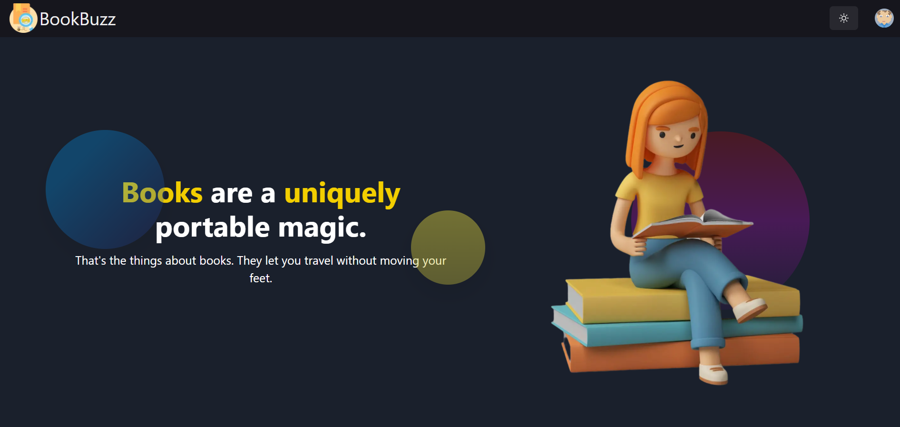

# BookBuzz

<h1 align="center">BookBuzz</h1>
<h6 align="center">BookBuzz - where you get motivated to read books.</h6>

<p align="center">

<a href="https://github.com/krishnan-tech/bookbuzz/watchers">
    
</a>

<a href="https://github.com/krishnan-tech/bookbuzz/stars">
    
</a>

<a href="https://github.com/krishnan-tech/bookbuzz/forks">
    
</a>

<a href="https://github.com/krishnan-tech/bookbuzz/blob/main/LICENSE">
    
</a>

</p>

<hr />

<p align="center">
    
</p>

<p>
This is the final submission for DotSlash 5.0 Hackathon.
</p>

Link of the hackathon: https://dotslash-1.devfolio.co/
Link of the project: https://devfolio.co/submissions/bookbuzz-a521

<hr />

## Installation

Install Dependencies for next-frontend

```bash
>>> cd next-frontend

>>> npm install
# or
>>> yarn
```

Then, run the development server:

```bash
>>> cd server

>>> yarn watch # for typescript

>>> npm run dev
# or
>>> yarn dev
```

Open [http://localhost:3000](http://localhost:3000) with your browser to see the result.

## Contributing

Pull requests are welcome. For major changes, please open an issue first to discuss what you would like to change.

## Join Me

I am actively developing cool projects, let's connect on discord to build it together: https://discord.gg/fGqbRjPyUp
